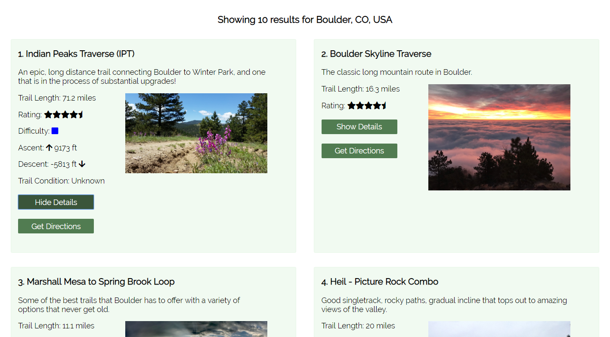

# TAKE A HIKE

An API-driven search tool that enables users to find local hikes by location, see trail information, and get directions. 

## Demo:

- [Live Demo](https://ryanjeske14.github.io/take-a-hike/)

## Screenshots

### Search Screen:

### Results Screen:

## Built With

### Front-End
* HTML
* CSS
* JavaScript
* jQuery

### APIs
* Google Geocoding API
* Hiking Project Data API

